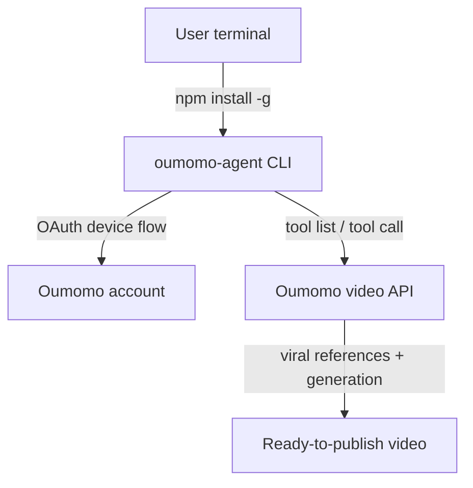
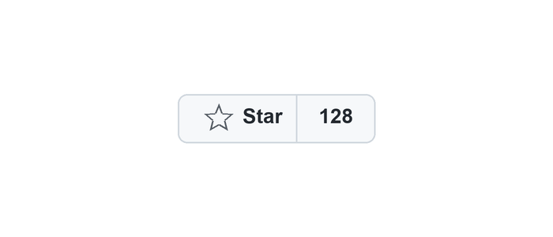

<p align="center">
  
</p>
<h1 align="center">Oumomo CLI</h1>
<p align="center">
  Turn viral TikToks and product links into shoppable videos from your terminal.
</p>

<p align="center">
  <a href="https://www.npmjs.com/package/oumomo-agent"></a>
  <a href="https://github.com/Oumomo-Video/oumomo-cli/blob/main/LICENSE"></a>
  <a href="https://github.com/Oumomo-Video/oumomo-cli/stargazers"></a>
  <a href="https://github.com/Oumomo-Video/oumomo-cli/commits/main"></a>
</p>

<p align="center">
  <a href="README.zh-CN.md">简体中文</a>
</p>

---

## Why Oumomo CLI?

Oumomo CLI turns a product link or a viral TikTok reference into a ready-to-generate ecommerce video—without leaving your terminal. The agent handles the conversation; `oumomo-agent` handles secure sign-in, product image uploads, and approved Oumomo tool calls.

---

## Quick start

```bash
npm install -g oumomo-agent
oumomo-agent setup
npx skills add Oumomo-Video/oumomo-skill
```

Then paste this to your agent:

```text
Remake a viral teeth-whitening TikTok for my product, or turn this TikTok Shop link into a video.
```

No OpenAI API key or MCP key is required—Oumomo manages the model and video generation backend.

---

## What it does

- **Finds proven reference videos** — recommends real, accessible viral TikToks for your product and target market.
- **Clones viral DNA** — turns a chosen reference into a shoppable remake for your product.
- **Reads product links** — supports TikTok Shop and FastMoss product-detail URLs.
- **Uploads product images** — reuses images from the conversation or asks for new ones.
- **Confirms before spending** — presents duration, language, aspect ratio, quality, and final prompt before any paid generation.

---

## How it works



The CLI is intentionally thin: prompts, adapters, and business execution stay on Oumomo servers. The local client only signs you in, uploads images, and calls approved tools. It is a lightweight client with zero production dependencies.

---

## Viral video remake

Start with a product category, product link, or reference video:

```text
Find high-performing US TikTok references for teeth-whitening strips and remake one as a product video.
```

Oumomo will:

1. Recommend relevant reference videos with accessible links.
2. Let you choose the creative direction.
3. Reuse product images from the conversation or ask you to upload them.
4. Accept optional multi-angle white-background images, a remake prompt, and requested changes.
5. Present duration, language, aspect ratio, quality, generation mode, and the final prompt for confirmation.
6. Generate only after your explicit confirmation, then track the task through completion.

---

## Product link to video

Send a supported TikTok Shop or FastMoss product-detail URL. Oumomo reads the product context, recommends viral references, and prepares the video for your approval.

---

## Try a reference video

Send one of these TikTok reference links together with your product image to start a viral remake:

- [Try reference video 1](https://vt.tiktok.com/ZSVVr1T8A/)
- [Try reference video 2](https://vt.tiktok.com/ZSVVr2gaA/)
- [Try reference video 3](https://vt.tiktok.com/ZSVVMt7wT/)

---

## CLI commands

Most users let the installed skill drive the CLI. These commands are also available for inspection and troubleshooting:

```bash
oumomo-agent auth status
oumomo-agent tool list
oumomo-agent tool describe video_replica_search
```

For programmatic use, add `--json`:

```bash
oumomo-agent tool list --json
oumomo-agent tool call video_replica_search --json '{"query":"teeth whitening strips"}'
```

---

## Claude Code / AI Agent integration

Give this message to Codex, Claude Code, or any skill-compatible agent:

```text
Set up Oumomo CLI so you can help me remake viral ecommerce videos and turn product links into videos.

1. Install the CLI: run `npm install -g oumomo-agent`.
2. Authenticate: run `oumomo-agent setup` and let me complete sign-in in the browser it opens.
3. Install the companion Skill: run `npx skills add Oumomo-Video/oumomo-skill`.

Once that is done, restart the agent and let me know when it is ready. Follow the Skill and use oumomo-agent to recommend accessible viral reference videos from my product link, category, or reference video. Submit generation only after I explicitly confirm the complete settings. Do not call a remote Agent or Chat endpoint.
```

Install the Skill directly:

```bash
npx skills add Oumomo-Video/oumomo-skill
```

---

## What you control

- Reference video and creative direction
- Product images and optional multi-angle white-background images
- Optional remake prompt and modification requirements
- Duration, language, aspect ratio, quality, and generation mode
- Final confirmation before any paid generation request

---

## Star this repo

If this helps you ship more product videos, a star makes it easier for others to find.

<p align="center">
  <a href="https://github.com/Oumomo-Video/oumomo-cli/stargazers">
    
  </a>
</p>

[](https://github.com/Oumomo-Video/oumomo-cli/stargazers)

---

## Contributing

PRs welcome. For feature requests and how-to questions, open a [Discussion](https://github.com/Oumomo-Video/oumomo-cli/discussions); for bugs, open an [Issue](https://github.com/Oumomo-Video/oumomo-cli/issues). You can also ping us on [X / Twitter](https://x.com/oumomoai).

---

## License

[MIT](LICENSE)

---

## Star History

[](https://star-history.com/#Oumomo-Video/oumomo-cli&Date)
