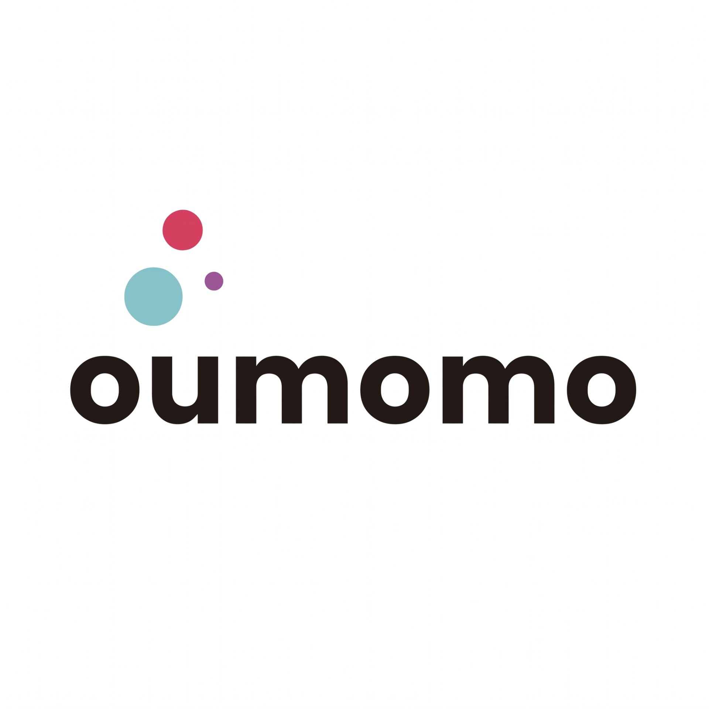
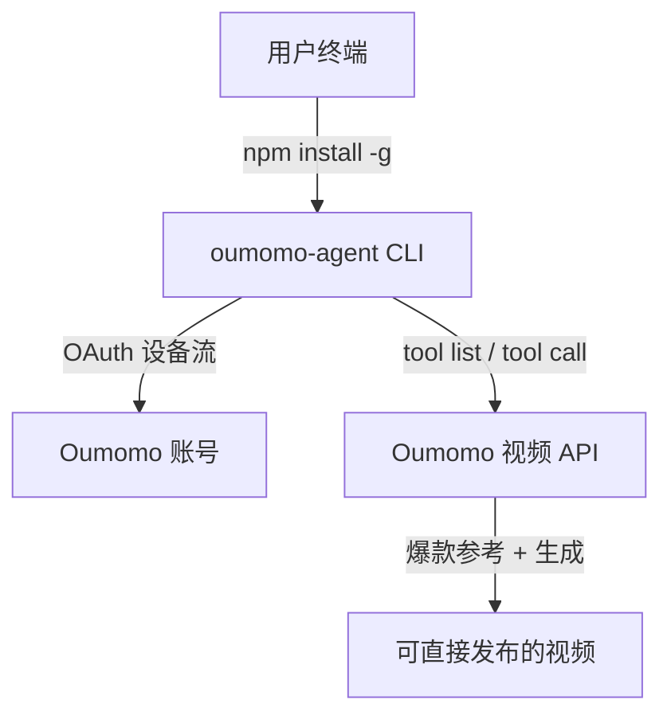

<p align="center">
  
</p>
<h1 align="center">Oumomo CLI</h1>
<p align="center">
  在终端里把爆款 TikTok 或商品链接直接变成可生成的电商视频。
</p>

<p align="center">
  <a href="https://www.npmjs.com/package/oumomo-agent"></a>
  <a href="https://github.com/Oumomo-Video/oumomo-cli/blob/main/LICENSE"></a>
  <a href="https://github.com/Oumomo-Video/oumomo-cli/stargazers"></a>
  <a href="https://github.com/Oumomo-Video/oumomo-cli/commits/main"></a>
</p>

<p align="center">
  <a href="README.md">English</a>
</p>

---

## 为什么用 Oumomo CLI？

Oumomo CLI 让你在终端里把一个商品链接或一条爆款 TikTok 参考视频，直接变成可生成的电商视频。对话由 Agent 主导，`oumomo-agent` 负责安全登录、商品图上传、调用 Oumomo 工具以及所有付费操作前的显式确认。它是一个零生产依赖的轻量客户端，不分发 Oumomo 的模型、提示词、适配器或智能体运行时。

---

## 快速开始

```bash
npm install -g oumomo-agent
oumomo-agent setup
npx skills add Oumomo-Video/oumomo-skill
```

装好后，把下面这句话丢给你的 Agent：

```text
帮我把这条爆款牙齿美白 TikTok 翻拍成我的商品视频，或者把这个 TikTok Shop 链接变成视频。
```

不需要 OpenAI API key，也不需要 MCP key——模型和视频生成都由 Oumomo 后端托管。

---

## 它能做什么

- **发现真实爆款参考** — 根据你的商品和目标市场推荐可访问的真实 TikTok 爆款。
- **翻拍爆款 DNA** — 把选中的参考视频翻拍成你的商品视频。
- **读取商品链接** — 支持 TikTok Shop 和 FastMoss 商品详情页链接。
- **上传商品图** — 复用对话里的图片，或提示你上传新的商品图/多视角白底图。
- **付费前强制确认** — 时长、语言、画幅、质量、最终 Prompt 全部确认后才提交生成。
- **独立运行（规划中）** — 内置 DeepSeek Harness，没有 Codex / Claude Code 也能 `oumomo-agent chat` 直接用。

---

## 工作原理



CLI 被故意做得非常轻：prompt、adapter 和业务执行都留在 Oumomo 服务端。本地客户端只做登录、上传图片、调用已授权工具三件事。

---

## 爆款视频翻拍

从产品类目、商品链接或参考视频开始：

```text
帮我找几条美国市场高赞的牙齿美白 TikTok 参考视频，并翻拍一条我的商品视频。
```

Oumomo 会：

1. 推荐相关且可访问的参考视频；
2. 让你选择创意方向；
3. 复用对话中的商品图或提示上传；
4. 可选：接收多视角白底图、翻拍 Prompt 和修改要求；
5. 展示时长、语言、画幅、质量、生成模式及最终 Prompt 等待你确认；
6. 只有在你显式确认后才会提交付费生成，并跟踪任务到完成。

---

## 商品链接转视频

发送一条支持的 TikTok Shop 或 FastMoss 商品详情链接。Oumomo 会读取商品信息，推荐合适的爆款参考，并为你准备好待确认的视频方案。

---

## 试用参考视频

把下面任意一条 TikTok 参考链接连同你的商品图一起发给 Agent，直接开始翻拍：

- [参考视频 1](https://vt.tiktok.com/ZSVVr1T8A/)
- [参考视频 2](https://vt.tiktok.com/ZSVVr2gaA/)
- [参考视频 3](https://vt.tiktok.com/ZSVVMt7wT/)

---

## 常用命令

通常只需让已安装的 Skill 操作 CLI。排查登录或工具状态时，也可以直接运行：

```bash
oumomo-agent auth status
oumomo-agent tool list
oumomo-agent tool describe video_replica_search
```

给程序化或 Harness 使用加上 `--json`：

```bash
oumomo-agent tool list --json
oumomo-agent tool call video_replica_search --json '{"query":"teeth whitening strips"}'
```

---

## Claude Code / AI Agent 集成

把下面这段直接发给 Codex、Claude Code 或任何支持 Skill 的 Agent：

```text
帮我配置好 Oumomo CLI，这样你可以帮我翻拍爆款电商视频，也可以把商品链接转成视频。

1. 安装 CLI：运行 `npm install -g oumomo-agent`。
2. 登录授权：运行 `oumomo-agent setup`，让我在弹出的浏览器里完成登录。
3. 安装配套 Skill：运行 `npx skills add Oumomo-Video/oumomo-skill`。

完成后重启 Agent 并告诉我已就绪。接下来请用 oumomo-agent 根据我的商品链接、类目或参考视频推荐可访问的爆款参考视频。只有在我明确确认完整生成设置后，才可以提交付费生成。不要直接调用远程 Agent 或 Chat 端点。
```

也可以直接安装 Skill：

```bash
npx skills add Oumomo-Video/oumomo-skill
```

---

## DeepSeek Harness（规划中）

没有宿主 Agent 也能用。Oumomo CLI 计划内置由 DeepSeek 驱动的轻量 agent loop：

```bash
export DEEPSEEK_API_KEY=sk-...
oumomo-agent chat
```

Harness 将使用同一份公开的 SKILL.md 作为 system prompt，驱动同一套 `oumomo-agent` 工具。所有付费生成仍会在终端里强制 `y/N` 确认后才扣费。

---

## 你控制什么

- 参考视频与创意方向
- 商品图和可选的多视角白底图
- 可选的翻拍 Prompt 和修改要求
- 时长、语言、画幅、质量、生成模式
- 最终确认前随时可以取消

---

## 点亮 Star

如果这个工具帮你多产出了商品视频，点个 star 能让更多人发现它。

[](https://github.com/Oumomo-Video/oumomo-cli/stargazers)

---

## 贡献代码

PR 欢迎。功能建议和用法问题请开 [Discussion](https://github.com/Oumomo-Video/oumomo-cli/discussions)，bug 请开 [Issue](https://github.com/Oumomo-Video/oumomo-cli/issues)，也可以在 [X / Twitter](https://x.com/oumomoai) 联系我们。

---

## 开源协议

[MIT](LICENSE)

---

## Star 历史

[](https://star-history.com/#Oumomo-Video/oumomo-cli&Date)
